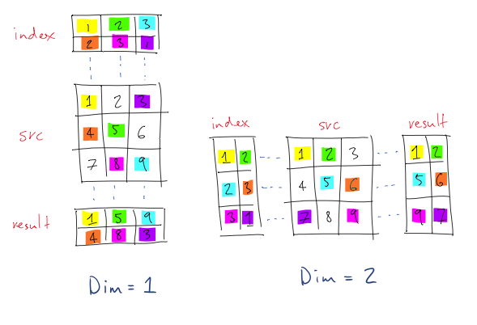

<a name="torch.Tensor.dok"></a>
# Tensor #

The `Tensor` class is probably the most important class in
`Torch`. Almost every package depends on this class. It is *__the__*
class for handling numeric data. As with   pretty much anything in
[Torch7](./index.md), tensors are
[serializable](file.md#torch.File.serialization).

__Multi-dimensional matrix__

A `Tensor` is a multi-dimensional matrix. The number of
dimensions is unlimited (up to what can be created using
[LongStorage](storage.md)).

Example:
```lua
 --- creation of a 4D-tensor 4x5x6x2
 z = torch.Tensor(4,5,6,2)
 --- for more dimensions, (here a 6D tensor) one can do:
 s = torch.LongStorage(6)
 s[1] = 4; s[2] = 5; s[3] = 6; s[4] = 2; s[5] = 7; s[6] = 3;
 x = torch.Tensor(s)
```

The number of dimensions of a `Tensor` can be queried by
[nDimension()](#torch.nDimension) or
[dim()](#torch.Tensor.dim). Size of the `i-th` dimension is
returned by [size(i)](#torch.Tensor.size). A [LongStorage](storage.md)
containing all the dimensions can be returned by
[size()](#torch.Tensor.size).

```lua
> x:nDimension()
6
> x:size()
 4
 5
 6
 2
 7
 3
[torch.LongStorage of size 6]
```

__Internal data representation__

The actual data of a `Tensor` is contained into a
[Storage](storage.md). It can be accessed using
[`storage()`](#torch.storage). While the memory of a
`Tensor` has to be contained in this unique `Storage`, it might
not be contiguous: the first position used in the `Storage` is given
by [`storageOffset()`](#torch.storageOffset) (starting at
`1`). And the _jump_ needed to go from one element to another
element in the `i-th` dimension is given by
[`stride(i)`](#torch.Tensor.stride). In other words, given a 3D
tensor

```lua
x = torch.Tensor(7,7,7)
```
accessing the element `(3,4,5)` can be done by
```lua
> x[3][4][5]
```
or equivalently (but slowly!)
```lua
> x:storage()[x:storageOffset()
              +(3-1)*x:stride(1)+(4-1)*x:stride(2)+(5-1)*x:stride(3)]
```
One could say that a `Tensor` is a particular way of _viewing_ a
`Storage`: a `Storage` only represents a chunk of memory, while the
`Tensor` interprets this chunk of memory as having dimensions:
```lua
x = torch.Tensor(4,5)
s = x:storage()
for i=1,s:size() do -- fill up the Storage
  s[i] = i
end
> x -- s is interpreted by x as a 2D matrix
  1   2   3   4   5
  6   7   8   9  10
 11  12  13  14  15
 16  17  18  19  20
[torch.DoubleTensor of dimension 4x5]
```

Note also that in Torch7 ___elements in the same row___ [elements along the __last__ dimension]
are contiguous in memory for a matrix [tensor]:
```lua
x = torch.Tensor(4,5)
i = 0

x:apply(function()
  i = i + 1
  return i
end)

> x
  1   2   3   4   5
  6   7   8   9  10
 11  12  13  14  15
 16  17  18  19  20
[torch.DoubleTensor of dimension 4x5]

> x:stride()
 5
 1  -- element in the last dimension are contiguous!
[torch.LongStorage of size 2]
```
This is exactly like in C (and not `Fortran`).

__Tensors of different types__

Actually, several types of `Tensor` exists:
```lua
ByteTensor -- contains unsigned chars
CharTensor -- contains signed chars
ShortTensor -- contains shorts
IntTensor -- contains ints
LongTensor -- contains longs
FloatTensor -- contains floats
DoubleTensor -- contains doubles
```

Most numeric operations are implemented _only_ for `FloatTensor` and `DoubleTensor`.
Other Tensor types are useful if you want to save memory space.

__Default Tensor type__

For convenience, _an alias_ `torch.Tensor` is provided, which allows the user to write
type-independent scripts, which can then ran after choosing the desired Tensor type with
a call like
```lua
torch.setdefaulttensortype('torch.FloatTensor')
```
See [torch.setdefaulttensortype](utility.md#torch.setdefaulttensortype) for more details.
By default, the alias "points" on `torch.DoubleTensor`.

__Efficient memory management__

_All_ tensor operations in this class do _not_ make any memory copy. All
these methods transform the existing tensor, or return a new tensor
referencing _the same storage_. This magical behavior is internally
obtained by good usage of the [stride()](#torch.Tensor.stride) and
[storageOffset()](#torch.storageOffset). Example:
```lua
x = torch.Tensor(5):zero()
> x
0
0
0
0
0
[torch.DoubleTensor of dimension 5]
> x:narrow(1, 2, 3):fill(1) -- narrow() returns a Tensor
                            -- referencing the same Storage as x
> x
 0
 1
 1
 1
 0
[torch.Tensor of dimension 5]
```

If you really need to copy a `Tensor`, you can use the [copy()](#torch.Tensor.copy) method:
```lua
y = torch.Tensor(x:size()):copy(x)
```
Or the convenience method
```lua
y = x:clone()
```

We now describe all the methods for `Tensor`. If you want to specify the Tensor type,
just replace `Tensor` by the name of the Tensor variant (like `CharTensor`).

<a name="torch.Tensor"></a>
## Tensor constructors ##

Tensor constructors, create new Tensor object, optionally, allocating
new memory. By default the elements of a newly allocated memory are
not initialized, therefore, might contain arbitrary numbers. Here are
several ways to construct a new `Tensor`.

<a name="torch.Tensor"></a>
### torch.Tensor() ###

Returns an empty tensor.

<a name="torch.Tensor"></a>
### torch.Tensor(tensor) ###

Returns a new tensor which reference the same
[Storage](#torch.storage) than the given `tensor`. The
[size](#torch.Tensor.size), [stride](#torch.Tensor.stride), and
[storage offset](#torch.storageOffset) are the same than the
given tensor.

The new `Tensor` is now going to "view" the same [storage](storage.md)
as the given `tensor`. As a result, any modification in the elements
of the `Tensor` will have a impact on the elements of the given
`tensor`, and vice-versa. No memory copy!

```lua
x = torch.Tensor(2,5):fill(3.14)
> x
 3.1400  3.1400  3.1400  3.1400  3.1400
 3.1400  3.1400  3.1400  3.1400  3.1400
[torch.DoubleTensor of dimension 2x5]

y = torch.Tensor(x)
> y
 3.1400  3.1400  3.1400  3.1400  3.1400
 3.1400  3.1400  3.1400  3.1400  3.1400
[torch.DoubleTensor of dimension 2x5]

y:zero()
> x -- elements of x are the same as y!
0 0 0 0 0
0 0 0 0 0
[torch.DoubleTensor of dimension 2x5]
```


<a name="torch.Tensor"></a>
### torch.Tensor(sz1 [,sz2 [,sz3 [,sz4]]]]) ###

Create a tensor up to 4 dimensions. The tensor size will be `sz1 x sz2 x sx3 x sz4`.

<a name="torch.Tensor"></a>
### torch.Tensor(sizes, [strides]) ###

Create a tensor of any number of dimensions. The
[LongStorage](storage.md) `sizes` gives the size in each dimension of
the tensor. The optional [LongStorage](storage.md) `strides` gives the
jump necessary to go from one element to the next one in the each
dimension. Of course, `sizes` and `strides` must have the same
number of elements. If not given, or if some elements of `strides`
are _negative_, the [stride()](#torch.Tensor.stride) will be
computed such that the tensor is as contiguous as possible in memory.

Example, create a 4D 4x4x3x2 tensor:
```lua
x = torch.Tensor(torch.LongStorage({4,4,3,2}))
```

Playing with the strides can give some interesting things:
```lua
x = torch.Tensor(torch.LongStorage({4}), torch.LongStorage({0})):zero() -- zeroes the tensor
x[1] = 1 -- all elements point to the same address!
> x
 1
 1
 1
 1
[torch.DoubleTensor of dimension 4]
```

Note that _negative strides are not allowed_, and, if given as
argument when constructing the Tensor, will be interpreted as //choose
the right stride such that the Tensor is contiguous in memory//.

Note _this method cannot be used to create `torch.LongTensor`s_.
The constructor [from a storage](tensor.md#torchtensorstorage-storageoffset-sizes-strides) will be used:
```lua
a = torch.LongStorage({1,2}) -- We have a torch.LongStorage containing the values 1 and 2
-- General case for TYPE ~= Long, e.g. for TYPE = Float:
b = torch.FloatTensor(a)
-- Creates a new torch.FloatTensor with 2 dimensions, the first of size 1 and the second of size 2
> b:size()
 1
 2
[torch.LongStorage of size 2]

-- Special case of torch.LongTensor
c = torch.LongTensor(a)
-- Creates a new torch.LongTensor that uses a as storage and thus contains the values 1 and 2
> c
 1
 2
[torch.LongTensor of size 2]
```

<a name="torch.Tensor"></a>
### torch.Tensor(storage, [storageOffset, sizes, [strides]]) ###

Returns a tensor which uses the existing [Storage](storage.md)
`storage`, starting at position `storageOffset` (>=1).  The size
of each dimension of the tensor is given by the
[LongStorage](storage.md) `sizes`.

If only `storage` is provided, it will create a 1D Tensor viewing
the all Storage.

The jump necessary to go from one element to the next one in each
dimension is given by the optional argument [LongStorage](storage.md)
`strides`. If not given, or if some elements of `strides` are
negative, the [stride()](#torch.Tensor.stride) will be computed such
that the tensor is as contiguous as possible in memory.

Any modification in the elements of the `Storage` will have an
impact on the elements of the new `Tensor`, and vice-versa. There is
no memory copy!

```lua
-- creates a storage with 10 elements
s = torch.Storage(10):fill(1)

-- we want to see it as a 2x5 tensor
x = torch.Tensor(s, 1, torch.LongStorage{2,5})
> x
 1  1  1  1  1
 1  1  1  1  1
[torch.DoubleTensor of dimension 2x5]

x:zero()
> s -- the storage contents have been modified
 0
 0
 0
 0
 0
 0
 0
 0
 0
 0
[torch.DoubleStorage of size 10]
```

<a name="torch.Tensor"></a>
### torch.Tensor(storage, [storageOffset, sz1 [, st1 ... [, sz4 [, st4]]]]) ###

Convenience constructor (for the previous constructor) assuming a
number of dimensions inferior or equal to 4. `szi` is the size in
the `i-th` dimension, and `sti` is the stride in the `i-th`
dimension.

<a name="torch.Tensor"></a>
### torch.Tensor(table) ###

The argument is assumed to be a Lua array of numbers. The constructor
returns a new Tensor of the size of the table, containing all the table
elements. The table might be multi-dimensional.

Example:
```lua
> torch.Tensor({{1,2,3,4}, {5,6,7,8}})
 1  2  3  4
 5  6  7  8
[torch.DoubleTensor of dimension 2x4]
```

## A note on function calls ##

The rest of this guide will present many functions that can be used to manipulate tensors. Most functions have been
defined so that they can be called flexibly, either in an object-oriented "method call" style i.e. `src:function(...)`
or a more "functional" style `torch.function(src, ...)`, where `src` is a tensor. Note that these different invocations
may differ in whether they modify the tensor in-place, or create a new tensor. Additionally, some functions can be
called in the form `dst:function(src, ...)` which usually suggests that the result of the operation on the `src` tensor
will be stored in the tensor `dst`.  Further details are given in the individual function definitions, below, but it
should be noted that the documentation is currently incomplete in this regard, and readers are encouraged to experiment
in an interactive session.

## Cloning ##

<a name="torch.Tensor.clone"></a>
### [Tensor] clone() ###

Returns a clone of a tensor. The memory is copied.

```lua
i = 0
x = torch.Tensor(5):apply(function(x)
  i = i + 1
  return i
end)
> x
 1
 2
 3
 4
 5
[torch.DoubleTensor of dimension 5]

-- create a clone of x
y = x:clone()
> y
 1
 2
 3
 4
 5
[torch.DoubleTensor of dimension 5]

-- fill up y with 1
y:fill(1)
> y
 1
 1
 1
 1
 1
[torch.DoubleTensor of dimension 5]

-- the contents of x were not changed:
> x
 1
 2
 3
 4
 5
[torch.DoubleTensor of dimension 5]
```

<a name="torch.Tensor.contiguous"></a>
### [Tensor] contiguous ###

  * If the given Tensor contents are contiguous in memory, returns the exact same Tensor (no memory copy).
  * Otherwise (_not contiguous in memory_), returns a [clone](#torch.Tensor.clone) (memory _copy_).

```lua
x = torch.Tensor(2,3):fill(1)
> x
 1  1  1
 1  1  1
[torch.DoubleTensor of dimension 2x3]

-- x is contiguous, so y points to the same thing
y = x:contiguous():fill(2)
> y
 2  2  2
 2  2  2
[torch.DoubleTensor of dimension 2x3]

-- contents of x have been changed
> x
 2  2  2
 2  2  2
[torch.DoubleTensor of dimension 2x3]

-- x:t() is not contiguous, so z is a clone
z = x:t():contiguous():fill(3.14)
> z
 3.1400  3.1400
 3.1400  3.1400
 3.1400  3.1400
[torch.DoubleTensor of dimension 3x2]

-- contents of x have not been changed
> x
 2  2  2
 2  2  2
[torch.DoubleTensor of dimension 2x3]
```

<a name="torch.type"></a>
### [Tensor or string] type(type) ###

__If `type` is `nil`__, returns a string containing the type name of
  the given tensor.

```lua
= torch.Tensor():type()
torch.DoubleTensor
```

__If `type` is a string__ describing a Tensor type, and is equal to
the given tensor typename, returns the exact same tensor (//no memory
copy//).

```lua
x = torch.Tensor(3):fill(3.14)
> x
 3.1400
 3.1400
 3.1400
[torch.DoubleTensor of dimension 3]

y = x:type('torch.DoubleTensor')
> y
 3.1400
 3.1400
 3.1400
[torch.DoubleTensor of dimension 3]

-- zero y contents
y:zero()

-- contents of x have been changed
> x
 0
 0
 0
[torch.DoubleTensor of dimension 3]

```

__If `type` is a string__ describing a Tensor type, different from
the type name of the given Tensor, returns a new Tensor of the
specified type, whose contents corresponds to the contents of the
original Tensor, casted to the given type (//memory copy occurs, with
possible loss of precision//).

```lua
x = torch.Tensor(3):fill(3.14)
> x
 3.1400
 3.1400
 3.1400
[torch.DoubleTensor of dimension 3]

y = x:type('torch.IntTensor')
> y
 3
 3
 3
[torch.IntTensor of dimension 3]

```

<a name="torch.Tensor.typeAs"></a>
### [Tensor] typeAs(tensor) ###

Convenience method for the [type](#torch.type) method. Equivalent to
```lua
type(tensor:type())
```

<a name="torch.isTensor"></a>
### [boolean] isTensor(object) ###

Returns `true` iff the provided `object` is one of the `torch.*Tensor` types.

```lua
> torch.isTensor(torch.randn(3,4))
true

> torch.isTensor(torch.randn(3,4)[1])
true

> torch.isTensor(torch.randn(3,4)[1][2])
false
```

<a name="torch.byte"></a>
### [Tensor] byte(), char(), short(), int(), long(), float(), double() ###
<a name="torch.Tensor.short"></a>
<a name="torch.Tensor.char"></a>
<a name="torch.Tensor.long"></a>
<a name="torch.Tensor.int"></a>
<a name="torch.Tensor.double"></a>
<a name="torch.Tensor.float"></a>

Convenience methods for the [type](#torch.type) method. For example:
```lua
x = torch.Tensor(3):fill(3.14)
> x
 3.1400
 3.1400
 3.1400
[torch.DoubleTensor of dimension 3]

-- calling type('torch.IntTensor')
> x:type('torch.IntTensor')
 3
 3
 3
[torch.IntTensor of dimension 3]


-- is equivalent to calling int()
> x:int()
 3
 3
 3
[torch.IntTensor of dimension 3]
```

## Querying the size and structure ##

<a name="torch.nDimension"></a>
### [number] nDimension() ###

Returns the number of dimensions in a `Tensor`.
```lua
x = torch.Tensor(4,5) -- a matrix
> x:nDimension()
2
```

<a name="torch.Tensor.dim"></a>
### [number] dim() ###

Same as [nDimension()](#torch.nDimension).

<a name="torch.Tensor.size"></a>
### [number] size(dim) ###

Returns the size of the specified dimension `dim`. Example:
```lua
x = torch.Tensor(4,5):zero()
> x
 0 0 0 0 0
 0 0 0 0 0
 0 0 0 0 0
 0 0 0 0 0
[torch.DoubleTensor of dimension 4x5]

> x:size(2) -- gets the number of columns
5
```

<a name="torch.Tensor.size"></a>
### [LongStorage] size() ###

Returns a [LongStorage](storage.md) containing the size of each dimension
of the tensor.
```lua
x = torch.Tensor(4,5):zero()
> x
 0 0 0 0 0
 0 0 0 0 0
 0 0 0 0 0
 0 0 0 0 0
[torch.DoubleTensor of dimension 4x5]

> x:size()
 4
 5
[torch.LongStorage of size 2]
```

<a name="torch.Tensor.size"></a>
### [LongStorage] #self ###

Same as [size()](#torch.Tensor.size) method.

<a name="torch.Tensor.stride"></a>
### [number] stride(dim) ###

Returns the jump necessary to go from one element to the next one in the
specified dimension `dim`. Example:
```lua
x = torch.Tensor(4,5):zero()
> x
 0 0 0 0 0
 0 0 0 0 0
 0 0 0 0 0
 0 0 0 0 0
[torch.DoubleTensor of dimension 4x5]

-- elements in a row are contiguous in memory
> x:stride(2)
1

-- to go from one element to the next one in a column
-- we need here to jump the size of the row
> x:stride(1)
5
```

Note also that in `Torch` _elements in the same row_ [elements along the __last__ dimension]
are contiguous in memory for a matrix [tensor].

<a name="torch.Tensor.stride"></a>
### [LongStorage] stride() ###

Returns the jump necessary to go from one element to the next one in each dimension. Example:
```lua
x = torch.Tensor(4,5):zero()
> x
 0 0 0 0 0
 0 0 0 0 0
 0 0 0 0 0
 0 0 0 0 0
[torch.DoubleTensor of dimension 4x5]

> x:stride()
 5
 1 -- elements are contiguous in a row [last dimension]
[torch.LongStorage of size 2]
```

Note also that in `Torch` _elements in the same row_ [elements along the __last__ dimension]
are contiguous in memory for a matrix [tensor].

<a name="torch.storage"></a>
### [Storage] storage() ###

Returns the [Storage](storage.md) used to store all the elements of the `Tensor`.
Basically, a `Tensor` is a particular way of _viewing_ a `Storage`.
```lua
x = torch.Tensor(4,5)
s = x:storage()
for i=1,s:size() do -- fill up the Storage
  s[i] = i
end

> x -- s is interpreted by x as a 2D matrix
  1   2   3   4   5
  6   7   8   9  10
 11  12  13  14  15
 16  17  18  19  20
[torch.DoubleTensor of dimension 4x5]
```

<a name="torch.Tensor.isContiguous"></a>
### [boolean] isContiguous() ###

Returns `true` iff the elements of the `Tensor` are contiguous in memory.
```lua
-- normal tensors are contiguous in memory
x = torch.randn(4,5)
> x:isContiguous()
true

-- y now "views" the 3rd column of x
-- the storage of y is the same than x
-- so the memory cannot be contiguous
y = x:select(2, 3)
> y:isContiguous()
false

-- indeed, to jump to one element to
-- the next one, the stride is 5
> y:stride()
 5
[torch.LongStorage of size 1]
```

<a name="torch.Tensor.isSize"></a>
### [boolean] isSize(storage) ###

Returns `true` iff the dimensions of the `Tensor` match the elements of the `storage`.
```lua
x = torch.Tensor(4,5)
y = torch.LongStorage({4,5})
z = torch.LongStorage({5,4,1})
> x:isSize(y)
true

> x:isSize(z)
false

> x:isSize(x:size())
true
```

<a name="torch.Tensor.isSameSizeAs"></a>
### [boolean] isSameSizeAs(tensor) ###

Returns `true` iff the dimensions of the `Tensor` and the argument `Tensor` are exactly the same.
```lua
x = torch.Tensor(4,5)
y = torch.Tensor(4,5)
> x:isSameSizeAs(y)
true

y = torch.Tensor(4,6)
> x:isSameSizeAs(y)
false
```

<a name="torch.Tensor.nElement"></a>
### [number] nElement() ###

Returns the number of elements of a tensor.
```lua
x = torch.Tensor(4,5)
> x:nElement() -- 4x5 = 20!
20
```

<a name="torch.storageOffset"></a>
### [number] storageOffset() ###

Return the first index (starting at 1) used in the tensor's [storage](#torch.storage).

<a name="torch.__index__"></a>
## Querying elements ##

Elements of a tensor can be retrieved with the `[index]` operator.

If `index` is a number, `[index]` operator is equivalent to a
[`select(1, index)`](#torch.Tensor.select). If the tensor has more
than one dimension, this operation returns a slice of the tensor that
shares the same underlying storage. If the tensor is a 1D tensor, it
returns the value at `index` in this tensor.

If `index` is a table, the table must contain _n_ numbers, where
_n_ is the [number of dimensions](#torch.nDimension) of the
Tensor. It will return the element at the given position.

In the same spirit, `index` might be a [LongStorage](storage.md),
specifying the position (in the Tensor) of the element to be
retrieved.

If `index` is a `ByteTensor` in which each element is 0 or 1 then it acts as a
selection mask used to extract a subset of the original tensor. This is
particularly useful with [logical operators](maths.md#logical-operations-on-tensors)
like [`torch.le`](maths.md#torchlea-b).

Example:
```lua
x = torch.Tensor(3,3)
i = 0; x:apply(function() i = i + 1; return i end)
> x
 1  2  3
 4  5  6
 7  8  9
[torch.DoubleTensor of dimension 3x3]

> x[2] -- returns row 2
 4
 5
 6
[torch.DoubleTensor of dimension 3]

> x[2][3] -- returns row 2, column 3
6

> x[{2,3}] -- another way to return row 2, column 3
6

> x[torch.LongStorage{2,3}] -- yet another way to return row 2, column 3
6

> x[torch.le(x,3)] -- torch.le returns a ByteTensor that acts as a mask
 1
 2
 3
[torch.DoubleTensor of dimension 3]
```

<a name="torch.Tensor.set"></a>
## Referencing a tensor to an existing tensor or chunk of memory ##

A `Tensor` being a way of _viewing_ a [Storage](storage.md), it is
possible to "set" a `Tensor` such that it views an existing [Storage](storage.md).

Note that if you want to perform a set on an empty `Tensor` like
```lua
y = torch.Storage(10)
x = torch.Tensor()
x:set(y, 1, 10)
```
you might want in that case to use one of the [equivalent constructor](#torch.Tensor).
```lua
y = torch.Storage(10)
x = torch.Tensor(y, 1, 10)
```

<a name="torch.Tensor.set"></a>
### [self] set(tensor) ###

The `Tensor` is now going to "view" the same [storage](#torch.storage)
as the given `tensor`. As the result, any modification in the elements of
the `Tensor` will have an impact on the elements of the given `tensor`, and
vice-versa. This is an efficient method, as there is no memory copy!

```lua
x = torch.Tensor(2,5):fill(3.14)
> x
 3.1400  3.1400  3.1400  3.1400  3.1400
 3.1400  3.1400  3.1400  3.1400  3.1400
[torch.DoubleTensor of dimension 2x5]

y = torch.Tensor():set(x)
> y
 3.1400  3.1400  3.1400  3.1400  3.1400
 3.1400  3.1400  3.1400  3.1400  3.1400
[torch.DoubleTensor of dimension 2x5]

y:zero()
> x -- elements of x are the same than y!
 0 0 0 0 0
 0 0 0 0 0
[torch.DoubleTensor of dimension 2x5]
```

<a name="torch.Tensor.isSetTo"></a>
### [boolean] isSetTo(tensor) ###

Returns true iff the `Tensor` is set to the argument `Tensor`. Note: this is
only true if the tensors are the same size, have the same strides and share the
same storage and offset.

```lua
x = torch.Tensor(2,5)
y = torch.Tensor()
> y:isSetTo(x)
 false
> y:set(x)
> y:isSetTo(x)
  true
> y:t():isSetTo(x)
  false -- x and y have different strides
```

<a name="torch.Tensor.set"></a>
### [self] set(storage, [storageOffset, sizes, [strides]]) ###

The `Tensor` is now going to "view" the given
[`storage`](storage.md), starting at position `storageOffset` (>=1)
with the given [dimension `sizes`](#torch.Tensor.size) and the optional given
[`strides`](#torch.Tensor.stride). As the result, any modification in the
elements of the `Storage` will have a impact on the elements of the
`Tensor`, and vice-versa. This is an efficient method, as there is no
memory copy!

If only `storage` is provided, the whole storage will be viewed as a 1D Tensor.

```lua
-- creates a storage with 10 elements
s = torch.Storage(10):fill(1)

-- we want to see it as a 2x5 tensor
sz = torch.LongStorage({2,5})
x = torch.Tensor()
x:set(s, 1, sz)
> x
 1  1  1  1  1
 1  1  1  1  1
[torch.DoubleTensor of dimension 2x5]

x:zero()
> s -- the storage contents have been modified
 0
 0
 0
 0
 0
 0
 0
 0
 0
 0
[torch.DoubleStorage of size 10]
```

<a name="torch.Tensor.set"></a>
### [self] set(storage, [storageOffset, sz1 [, st1 ... [, sz4 [, st4]]]]) ###

This is a "shortcut" for previous method.
It works up to 4 dimensions. `szi` is the size of the `i`-th dimension of the tensor.
`sti` is the stride in the `i`-th dimension.

## Copying and initializing ##

<a name="torch.Tensor.copy"></a>
### [self] copy(tensor) ###

Replace the elements of the `Tensor` by copying the elements of the given `tensor`. The
[number of elements](#torch.Tensor.nElement) must match, but the
sizes might be different.

```lua
x = torch.Tensor(4):fill(1)
y = torch.Tensor(2,2):copy(x)
> x
 1
 1
 1
 1
[torch.DoubleTensor of dimension 4]

> y
 1  1
 1  1
[torch.DoubleTensor of dimension 2x2]
```

If a different type of `tensor` is given, then a type conversion occurs,
which, of course, might result in loss of precision.

<a name="torch.fill"></a>
### [self] fill(value) ###

Fill the tensor with the given `value`.
```lua
> torch.DoubleTensor(4):fill(3.14)
 3.1400
 3.1400
 3.1400
 3.1400
[torch.DoubleTensor of dimension 4]
```

<a name="torch.zero"></a>
### [self] zero() ###

Fill the tensor with zeros.
```lua
> torch.Tensor(4):zero()
 0
 0
 0
 0
[torch.DoubleTensor of dimension 4]
```

<a name="torch.resize.dok"></a>
## Resizing ##

__When resizing to a larger size__, the underlying [Storage](storage.md) is resized to fit
all the elements of the `Tensor`.

__When resizing to a smaller size__, the underlying [Storage](#Storage) is not resized.

__Important note:__ the content of a `Tensor` after resizing is _undetermined_ as [strides](#torch.Tensor.stride)
might have been completely changed. In particular, _the elements of the resized tensor are contiguous in memory_.

<a name="torch.Tensor.resizeAs"></a>
### [self] resizeAs(tensor) ###

Resize the `tensor` as the given `tensor` (of the same type).

<a name="torch.resize"></a>
### [self] resize(sizes) ###

Resize the `tensor` according to the given [LongStorage](storage.md) `sizes`.

<a name="torch.resize"></a>
### [self] resize(sz1 [,sz2 [,sz3 [,sz4]]]]) ###

Convenience method of the previous method, working for a number of dimensions up to 4.

## Extracting sub-tensors ##

Each of these methods returns a `Tensor` which is a sub-tensor of the given
tensor. 

For methods `narrow`, `select` and `sub` the returned tensor _shares the same `Storage`_ as the original. Hence, any modification in the memory of the sub-tensor will have an impact on the primary tensor, and vice-versa. These methods are very fast, as they do not involve any memory copy.

For all other methods in this section such as `index`, `indexCopy` etc., since you cannot extract a shared subtensor (technically), a new tensor is returned. If you make changes in this new tensor, they are not reflected in the original tensor.

<a name="torch.Tensor.narrow"></a>
### [self] narrow(dim, index, size) ###

Returns a new `Tensor` which is a narrowed version of the current one: the dimension `dim` is narrowed
from `index` to `index+size-1`.

```lua
x = torch.Tensor(5, 6):zero()
> x

0 0 0 0 0 0
0 0 0 0 0 0
0 0 0 0 0 0
0 0 0 0 0 0
0 0 0 0 0 0
[torch.DoubleTensor of dimension 5x6]

y = x:narrow(1, 2, 3) -- narrow dimension 1 from index 2 to index 2+3-1
y:fill(1) -- fill with 1
> y
 1  1  1  1  1  1
 1  1  1  1  1  1
 1  1  1  1  1  1
[torch.DoubleTensor of dimension 3x6]

> x -- memory in x has been modified!
 0  0  0  0  0  0
 1  1  1  1  1  1
 1  1  1  1  1  1
 1  1  1  1  1  1
 0  0  0  0  0  0
[torch.DoubleTensor of dimension 5x6]
```

<a name="torch.Tensor.sub"></a>
### [Tensor] sub(dim1s, dim1e ... [, dim4s [, dim4e]]) ###

This method is equivalent to do a series of
[narrow](#torch.Tensor.narrow) up to the first 4 dimensions.  It
returns a new `Tensor` which is a sub-tensor going from index
`dimis` to `dimie` in the `i`-th dimension. Negative values are
interpreted index starting from the end: `-1` is the last index,
`-2` is the index before the last index, ...

```lua
x = torch.Tensor(5, 6):zero()
> x
 0 0 0 0 0 0
 0 0 0 0 0 0
 0 0 0 0 0 0
 0 0 0 0 0 0
 0 0 0 0 0 0
[torch.DoubleTensor of dimension 5x6]

y = x:sub(2,4):fill(1) -- y is sub-tensor of x:
> y                    -- dimension 1 starts at index 2, ends at index 4
 1  1  1  1  1  1
 1  1  1  1  1  1
 1  1  1  1  1  1
[torch.DoubleTensor of dimension 3x6]

> x                    -- x has been modified!
 0  0  0  0  0  0
 1  1  1  1  1  1
 1  1  1  1  1  1
 1  1  1  1  1  1
 0  0  0  0  0  0
[torch.DoubleTensor of dimension 5x6]

z = x:sub(2,4,3,4):fill(2) -- we now take a new sub-tensor
> z                        -- dimension 1 starts at index 2, ends at index 4
                           -- dimension 2 starts at index 3, ends at index 4
 2  2
 2  2
 2  2
[torch.DoubleTensor of dimension 3x2]

> x                        -- x has been modified
 0  0  0  0  0  0
 1  1  2  2  1  1
 1  1  2  2  1  1
 1  1  2  2  1  1
 0  0  0  0  0  0
[torch.DoubleTensor of dimension 5x6]

> y                        -- y has been modified
 1  1  2  2  1  1
 1  1  2  2  1  1
 1  1  2  2  1  1
[torch.DoubleTensor of dimension 3x6]

> y:sub(-1, -1, 3, 4)      -- negative values = bounds
 2  2
[torch.DoubleTensor of dimension 1x2]
```

<a name="torch.Tensor.select"></a>
### [Tensor] select(dim, index) ###

Returns a new `Tensor` which is a tensor slice at the given `index` in the
dimension `dim`. The returned tensor has one less dimension: the dimension
`dim` is removed.  As a result, it is not possible to `select()` on a 1D
tensor.

Note that "selecting" on the first dimension is equivalent to use the [[] operator](#torch.__index__ )

```lua
x = torch.Tensor(5,6):zero()
> x
 0 0 0 0 0 0
 0 0 0 0 0 0
 0 0 0 0 0 0
 0 0 0 0 0 0
 0 0 0 0 0 0
[torch.DoubleTensor of dimension 5x6]

y = x:select(1, 2):fill(2) -- select row 2 and fill up
> y
 2
 2
 2
 2
 2
 2
[torch.DoubleTensor of dimension 6]

> x
 0  0  0  0  0  0
 2  2  2  2  2  2
 0  0  0  0  0  0
 0  0  0  0  0  0
 0  0  0  0  0  0
[torch.DoubleTensor of dimension 5x6]

z = x:select(2,5):fill(5) -- select column 5 and fill up
> z
 5
 5
 5
 5
 5
[torch.DoubleTensor of dimension 5]

> x
 0  0  0  0  5  0
 2  2  2  2  5  2
 0  0  0  0  5  0
 0  0  0  0  5  0
 0  0  0  0  5  0
[torch.DoubleTensor of dimension 5x6]
```

<a name="torch.Tensor.indexing"></a>
### [Tensor] [{ dim1,dim2,... }] or [{ {dim1s,dim1e}, {dim2s,dim2e} }] ###

The indexing operator [] can be used to combine narrow/sub and
select in a concise and efficient way. It can also be used
to copy, and fill (sub) tensors.

This operator also works with an input mask made of a `ByteTensor` with 0 and 1
elements, e.g with a [logical operator](maths.md#logical-operations-on-tensors).

```lua
x = torch.Tensor(5, 6):zero()
> x
 0 0 0 0 0 0
 0 0 0 0 0 0
 0 0 0 0 0 0
 0 0 0 0 0 0
 0 0 0 0 0 0
[torch.DoubleTensor of dimension 5x6]

x[{ 1,3 }] = 1 -- sets element at (i=1,j=3) to 1
> x
 0  0  1  0  0  0
 0  0  0  0  0  0
 0  0  0  0  0  0
 0  0  0  0  0  0
 0  0  0  0  0  0
[torch.DoubleTensor of dimension 5x6]

x[{ 2,{2,4} }] = 2  -- sets a slice of 3 elements to 2
> x
 0  0  1  0  0  0
 0  2  2  2  0  0
 0  0  0  0  0  0
 0  0  0  0  0  0
 0  0  0  0  0  0
[torch.DoubleTensor of dimension 5x6]

x[{ {},4 }] = -1 -- sets the full 4th column to -1
> x
 0  0  1 -1  0  0
 0  2  2 -1  0  0
 0  0  0 -1  0  0
 0  0  0 -1  0  0
 0  0  0 -1  0  0
[torch.DoubleTensor of dimension 5x6]

x[{ {},2 }] = torch.range(1,5) -- copy a 1D tensor to a slice of x
> x

 0  1  1 -1  0  0
 0  2  2 -1  0  0
 0  3  0 -1  0  0
 0  4  0 -1  0  0
 0  5  0 -1  0  0
[torch.DoubleTensor of dimension 5x6]

x[torch.lt(x,0)] = -2 -- sets all negative elements to -2 via a mask
> x

 0  1  1 -2  0  0
 0  2  2 -2  0  0
 0  3  0 -2  0  0
 0  4  0 -2  0  0
 0  5  0 -2  0  0
[torch.DoubleTensor of dimension 5x6]
```

<a name="torch.Tensor.index"></a>
### [Tensor] index(dim, index) ###

Returns a new `Tensor` which indexes the original `Tensor` along dimension `dim`
using the entries in `torch.LongTensor` `index`.
The returned `Tensor` has the same number of dimensions as the original `Tensor`.
The returned `Tensor` does __not__ use the same storage as the original `Tensor` -- see below for storing the result
 in an existing `Tensor`.

```lua
x = torch.rand(5,5)
> x
 0.8020  0.7246  0.1204  0.3419  0.4385
 0.0369  0.4158  0.0985  0.3024  0.8186
 0.2746  0.9362  0.2546  0.8586  0.6674
 0.7473  0.9028  0.1046  0.9085  0.6622
 0.1412  0.6784  0.1624  0.8113  0.3949
[torch.DoubleTensor of dimension 5x5]

y = x:index(1,torch.LongTensor{3,1})
> y
 0.2746  0.9362  0.2546  0.8586  0.6674
 0.8020  0.7246  0.1204  0.3419  0.4385
[torch.DoubleTensor of dimension 2x5]

y:fill(1)
> y
 1  1  1  1  1
 1  1  1  1  1
[torch.DoubleTensor of dimension 2x5]

> x
 0.8020  0.7246  0.1204  0.3419  0.4385
 0.0369  0.4158  0.0985  0.3024  0.8186
 0.2746  0.9362  0.2546  0.8586  0.6674
 0.7473  0.9028  0.1046  0.9085  0.6622
 0.1412  0.6784  0.1624  0.8113  0.3949
[torch.DoubleTensor of dimension 5x5]

```

Note the explicit `index` function is different than the indexing operator `[]`.
The indexing operator `[]` is a syntactic shortcut for a series of select and narrow operations,
therefore it always returns a new view on the original tensor that shares the same storage.
However, the explicit `index` function can not use the same storage.

It is possible to store the result into an existing Tensor with `result:index(source, ...)`:

```lua
x = torch.rand(5,5)
> x
 0.8020  0.7246  0.1204  0.3419  0.4385
 0.0369  0.4158  0.0985  0.3024  0.8186
 0.2746  0.9362  0.2546  0.8586  0.6674
 0.7473  0.9028  0.1046  0.9085  0.6622
 0.1412  0.6784  0.1624  0.8113  0.3949
[torch.DoubleTensor of dimension 5x5]

y = torch.Tensor()
y:index(x,1,torch.LongTensor{3,1})
> y
 0.2746  0.9362  0.2546  0.8586  0.6674
 0.8020  0.7246  0.1204  0.3419  0.4385
[torch.DoubleTensor of dimension 2x5]
```


<a name="torch.Tensor.indexCopy"></a>
### [Tensor] indexCopy(dim, index, tensor) ###

Copies the elements of `tensor` into the original tensor by selecting the indices in the order
given in `index`. The shape of `tensor` must exactly match the elements indexed or an error will be thrown.

```lua
> x
 0.8020  0.7246  0.1204  0.3419  0.4385
 0.0369  0.4158  0.0985  0.3024  0.8186
 0.2746  0.9362  0.2546  0.8586  0.6674
 0.7473  0.9028  0.1046  0.9085  0.6622
 0.1412  0.6784  0.1624  0.8113  0.3949
[torch.DoubleTensor of dimension 5x5]

z=torch.Tensor(5,2)
z:select(2,1):fill(-1)
z:select(2,2):fill(-2)
> z
-1 -2
-1 -2
-1 -2
-1 -2
-1 -2
[torch.DoubleTensor of dimension 5x2]

x:indexCopy(2,torch.LongTensor{5,1},z)
> x
-2.0000  0.7246  0.1204  0.3419 -1.0000
-2.0000  0.4158  0.0985  0.3024 -1.0000
-2.0000  0.9362  0.2546  0.8586 -1.0000
-2.0000  0.9028  0.1046  0.9085 -1.0000
-2.0000  0.6784  0.1624  0.8113 -1.0000
[torch.DoubleTensor of dimension 5x5]

```

<a name="torch.Tensor.indexAdd"></a>
### [Tensor] indexAdd(dim, index, tensor) ###

Accumulate the elements of `tensor` into the original tensor by adding to the indices in the order
given in `index`. The shape of `tensor` must exactly match the elements indexed or an error will be thrown.

```lua
Example 1

> x
-2.1742  0.5688 -1.0201  0.1383  1.0504
 0.0970  0.2169  0.1324  0.9553 -1.9518
-0.7607  0.8947  0.1658 -0.2181 -2.1237
-1.4099  0.2342  0.4549  0.6316 -0.2608
 0.0349  0.4713  0.0050  0.1677  0.2103
[torch.DoubleTensor of size 5x5]

z=torch.Tensor(5, 2)
z:select(2,1):fill(-1)
z:select(2,2):fill(-2)
> z
-1 -2
-1 -2
-1 -2
-1 -2
-1 -2
[torch.DoubleTensor of dimension 5x2]

> x:indexAdd(2,torch.LongTensor{5,1},z)
> x
-4.1742  0.5688 -1.0201  0.1383  0.0504
-1.9030  0.2169  0.1324  0.9553 -2.9518
-2.7607  0.8947  0.1658 -0.2181 -3.1237
-3.4099  0.2342  0.4549  0.6316 -1.2608
-1.9651  0.4713  0.0050  0.1677 -0.7897
[torch.DoubleTensor of size 5x5]

Example 2

> a = torch.range(1, 5)
> a
 1
 2
 3
 4
 5
[torch.DoubleTensor of size 5]

> a:indexAdd(1, torch.LongTensor{1, 1, 3, 3}, torch.range(1, 4))
> a
  4
  2
 10
  4
  5
[torch.DoubleTensor of size 5]

```

<a name="torch.Tensor.indexFill"></a>
### [Tensor] indexFill(dim, index, val) ###

Fills the elements of the original `Tensor` with value `val` by selecting the indices in the order
given in `index`.

```lua
x=torch.rand(5,5)
> x
 0.8414  0.4121  0.3934  0.5600  0.5403
 0.3029  0.2040  0.7893  0.6079  0.6334
 0.3743  0.1389  0.1573  0.1357  0.8460
 0.2838  0.9925  0.0076  0.7220  0.5185
 0.8739  0.6887  0.4271  0.0385  0.9116
[torch.DoubleTensor of dimension 5x5]

x:indexFill(2,torch.LongTensor{4,2},-10)
> x
  0.8414 -10.0000   0.3934 -10.0000   0.5403
  0.3029 -10.0000   0.7893 -10.0000   0.6334
  0.3743 -10.0000   0.1573 -10.0000   0.8460
  0.2838 -10.0000   0.0076 -10.0000   0.5185
  0.8739 -10.0000   0.4271 -10.0000   0.9116
[torch.DoubleTensor of dimension 5x5]

```

<a name="torch.Tensor.gather"></a>
### [Tensor] gather(dim, index) ###

Creates a new `Tensor` from the original tensor by gathering a number of values from
each "row", where the rows are along the dimension `dim`. The values in a `LongTensor`, passed as `index`,
specify which values to take from each row. Specifically, the resulting `Tensor`, which will have the same size as
the `index` tensor, is given by

```lua
-- dim = 1
result[i][j][k]... = src[index[i][j][k]...][j][k]...

-- dim = 2
result[i][j][k]... = src[i][index[i][j][k]...][k]...

-- etc.
```
where `src` is the original `Tensor`.

The same number of values are selected from each row, and the same value cannot be selected from a row more than
once. The values in the `index` tensor must not be larger than the length of the row, that is they must be between
1 and `src:size(dim)` inclusive. It can be somewhat confusing to ensure that the `index` tensor has the correct shape.
Viewed pictorially:



Numerically, to give an example, if `src` has size `n x m x p x q`, we are gathering along `dim = 3`, and we wish to
gather `k` elements from each row (where `k <= p`) then `index` must have size `n x m x k x q`.

It is possible to store the result into an existing Tensor with `result:gather(src, ...)`.

```lua
x = torch.rand(5, 5)
> x
 0.7259  0.5291  0.4559  0.4367  0.4133
 0.0513  0.4404  0.4741  0.0658  0.0653
 0.3393  0.1735  0.6439  0.1011  0.7923
 0.7606  0.5025  0.5706  0.7193  0.1572
 0.1720  0.3546  0.8354  0.8339  0.3025
[torch.DoubleTensor of size 5x5]

y = x:gather(1, torch.LongTensor{{1, 2, 3, 4, 5}, {2, 3, 4, 5, 1}})
> y
 0.7259  0.4404  0.6439  0.7193  0.3025
 0.0513  0.1735  0.5706  0.8339  0.4133
[torch.DoubleTensor of size 2x5]

z = x:gather(2, torch.LongTensor{{1, 2}, {2, 3}, {3, 4}, {4, 5}, {5, 1}})
> z
 0.7259  0.5291
 0.4404  0.4741
 0.6439  0.1011
 0.7193  0.1572
 0.3025  0.1720
[torch.DoubleTensor of size 5x2]

```

<a name="torch.Tensor.scatter"></a>
### [Tensor] scatter(dim, index, src|val) ###

Writes all values from tensor `src` or the scalar `val` into `self` at the specified indices. The indices are specified
with respect to the given dimension, `dim`, in the manner described in [gather](#torch.Tensor.gather). Note that, as
for gather, the values of index must be between 1 and `self:size(dim)` inclusive and all values in a row along the
specified dimension must be unique.

```lua
x = torch.rand(2, 5)
> x
 0.3227  0.4294  0.8476  0.9414  0.1159
 0.7338  0.5185  0.2947  0.0578  0.1273
[torch.DoubleTensor of size 2x5]

y = torch.zeros(3, 5):scatter(1, torch.LongTensor{{1, 2, 3, 1, 1}, {3, 1, 1, 2, 3}}, x)
> y
 0.3227  0.5185  0.2947  0.9414  0.1159
 0.0000  0.4294  0.0000  0.0578  0.0000
 0.7338  0.0000  0.8476  0.0000  0.1273
[torch.DoubleTensor of size 3x5]

z = torch.zeros(2, 4):scatter(2, torch.LongTensor{{3}, {4}}, 1.23)
> z
 0.0000  0.0000  1.2300  0.0000
 0.0000  0.0000  0.0000  1.2300
[torch.DoubleTensor of size 2x4]

```

<a name="torch.Tensor.maskedSelect"></a>
### [Tensor] maskedSelect(mask) ###

Returns a new Tensor which contains all elements aligned to a `1` in the corresponding
`mask`. This `mask` is a `torch.ByteTensor` of zeros and ones. The `mask` and
`Tensor` must have the same number of elements. The resulting Tensor will
be a 1D tensor of the same type as `Tensor` having size `mask:sum()`.

```lua
x = torch.range(1,12):double():resize(3,4)
> x
  1   2   3   4
  5   6   7   8
  9  10  11  12
[torch.DoubleTensor of dimension 3x4]

mask = torch.ByteTensor(2,6):bernoulli()
> mask
 1  0  1  0  0  0
 1  1  0  0  0  1
[torch.ByteTensor of dimension 2x6]

y = x:maskedSelect(mask)
> y
  1
  3
  7
  8
 12
[torch.DoubleTensor of dimension 5]

z = torch.DoubleTensor()
z:maskedSelect(x, mask)
> z
  1
  3
  7
  8
 12
```

Note how the dimensions of the above `x`, `mask` and `y` do not match.
Also note how an existing tensor `z` can be used to store the results.


<a name="torch.Tensor.maskedCopy"></a>
### [Tensor] maskedCopy(mask, tensor) ###

Copies the elements of `tensor` into `mask` locations of itself. The masked elements are those elements having a
corresponding `1` in the `mask` Tensor. This `mask` is a `torch.ByteTensor`
of zeros and ones. The destination `Tensor` and the `mask` Tensor should have the same number of elements.
The source `tensor` should have at least as many elements as the number of 1s in the `mask`.

```lua
x = torch.Tensor({0, 0, 0, 0})
mask = torch.ByteTensor({0, 1, 0, 1})
y = torch.Tensor({10, 20})
x:maskedCopy(mask,y)
print(x)

  0
 10
  0
 20
[torch.DoubleTensor of size 4]
```

```lua
x = torch.range(1,4):double():resize(2,2)
> x
 1  2
 3  4
[torch.DoubleTensor of dimension 2x4]

mask = torch.ByteTensor(1,8):bernoulli()
> mask
 0  0  1  1  1  0  1  0
[torch.ByteTensor of dimension 1x8]

y = torch.DoubleTensor(2,4):fill(-1)
> y
-1 -1 -1 -1
-1 -1 -1 -1
[torch.DoubleTensor of dimension 2x4]

y:maskedCopy(mask, x)
> y
 -1 -1  1  2
  3 -1  4 -1
[torch.DoubleTensor of dimension 2x4]
```

Note how the dimensions of the above `x`, `mask` and `y` do not match,
but the number of elements do.

<a name="torch.Tensor.maskedFill"></a>
### [Tensor] maskedFill(mask, val) ###

Fills the masked elements of itself with value `val`. The masked elements are those elements having a
corresponding `1` in the `mask` Tensor. This `mask` is a `torch.ByteTensor`
of zeros and ones. The `mask` and `Tensor` must have the same number of elements.

```lua
x = torch.range(1,4):double():resize(1,4)
> x
 1  2  3  4
[torch.DoubleTensor of dimension 1x4]

mask = torch.ByteTensor(2,2):bernoulli()
> mask
 0  0
 1  1
[torch.ByteTensor of dimension 2x2]

x:maskedFill(mask, -1)
> x
 1  2 -1 -1
[torch.DoubleTensor of dimension 1x4]

```
Note how the dimensions of the above `x` and `mask` do not match,
but the number of elements do.

## Search ##

Each of these methods returns a `LongTensor` corresponding to the indices of the
given search operation.

<a name="torch.Tensor.nonzero"></a>
### [LongTensor] nonzero(tensor) ###

Finds and returns a `LongTensor` corresponding to the *subscript* indices of all
non-zero elements in `tensor`.

Note that torch uses the first argument on dispatch to determine the return
type. Since the first argument is any `torch.TensorType`, but the return type
is always `torch.LongTensor`, the function call
`torch.nonzero(torch.LongTensor(), tensor)` does not work. However,
`tensor.nonzero(torch.LongTensor(), tensor)` does work.

```lua
> x = torch.rand(4, 4):mul(3):floor():int()
> x
 2  0  2  0
 0  0  1  2
 0  2  2  1
 2  1  2  2
[torch.IntTensor of dimension 4x4]

> torch.nonzero(x)
 1  1
 1  3
 2  3
 2  4
 3  2
 3  3
 3  4
 4  1
 4  2
 4  3
 4  4
[torch.LongTensor of dimension 11x2]

> x:nonzero()
 1  1
 1  3
 2  3
 2  4
 3  2
 3  3
 3  4
 4  1
 4  2
 4  3
 4  4
[torch.LongTensor of dimension 11x2]

> indices = torch.LongTensor()
> x.nonzero(indices, x)
 1  1
 1  3
 2  3
 2  4
 3  2
 3  3
 3  4
 4  1
 4  2
 4  3
 4  4
[torch.LongTensor of dimension 11x2]

> x:eq(1):nonzero()
 2  3
 3  4
 4  2
[torch.LongTensor of dimension 3x2]

```

## Expanding/Replicating/Squeezing Tensors ##

These methods returns a Tensor which is created by replications of the
original tensor.

<a name="torch.expand"></a>
### [result] expand([result,] sizes) ###

`sizes` can either be a `torch.LongStorage` or numbers. Expanding a tensor
does not allocate new memory, but only creates a new view on the existing tensor where
singleton dimensions can be expanded to multiple ones by setting the `stride` to 0.
Any dimension that has size 1 can be expanded to arbitrary value without any new memory allocation. Attempting to
expand along a dimension that does not have size 1 will result in an error.

```lua
x = torch.rand(10,1)
> x
 0.3837
 0.5966
 0.0763
 0.1896
 0.4958
 0.6841
 0.4038
 0.4068
 0.1502
 0.2239
[torch.DoubleTensor of dimension 10x1]

y = torch.expand(x,10,2)
> y
 0.3837  0.3837
 0.5966  0.5966
 0.0763  0.0763
 0.1896  0.1896
 0.4958  0.4958
 0.6841  0.6841
 0.4038  0.4038
 0.4068  0.4068
 0.1502  0.1502
 0.2239  0.2239
[torch.DoubleTensor of dimension 10x2]

y:fill(1)
> y
 1  1
 1  1
 1  1
 1  1
 1  1
 1  1
 1  1
 1  1
 1  1
 1  1
[torch.DoubleTensor of dimension 10x2]

> x
 1
 1
 1
 1
 1
 1
 1
 1
 1
 1
[torch.DoubleTensor of dimension 10x1]

i=0; y:apply(function() i=i+1;return i end)
> y
  2   2
  4   4
  6   6
  8   8
 10  10
 12  12
 14  14
 16  16
 18  18
 20  20
[torch.DoubleTensor of dimension 10x2]

> x
  2
  4
  6
  8
 10
 12
 14
 16
 18
 20
[torch.DoubleTensor of dimension 10x1]

```

<a name="torch.Tensor.expandAs"></a>
### [result] expandAs([result,] tensor) ###

This is equivalent to `self:expand(tensor:size())`

<a name="torch.repeatTensor"></a>
### [Tensor] repeatTensor([result,] sizes) ###

`sizes` can either be a `torch.LongStorage` or numbers. Repeating a tensor allocates
 new memory, unless `result` is provided, in which case its memory is
 resized. `sizes` specify the number of times the tensor is repeated in each dimension.

 ```lua
x = torch.rand(5)
> x
 0.7160
 0.6514
 0.0704
 0.7856
 0.7452
[torch.DoubleTensor of dimension 5]

> torch.repeatTensor(x,3,2)
 0.7160  0.6514  0.0704  0.7856  0.7452  0.7160  0.6514  0.0704  0.7856  0.7452
 0.7160  0.6514  0.0704  0.7856  0.7452  0.7160  0.6514  0.0704  0.7856  0.7452
 0.7160  0.6514  0.0704  0.7856  0.7452  0.7160  0.6514  0.0704  0.7856  0.7452
[torch.DoubleTensor of dimension 3x10]

> torch.repeatTensor(x,3,2,1)
(1,.,.) =
  0.7160  0.6514  0.0704  0.7856  0.7452
  0.7160  0.6514  0.0704  0.7856  0.7452

(2,.,.) =
  0.7160  0.6514  0.0704  0.7856  0.7452
  0.7160  0.6514  0.0704  0.7856  0.7452

(3,.,.) =
  0.7160  0.6514  0.0704  0.7856  0.7452
  0.7160  0.6514  0.0704  0.7856  0.7452
[torch.DoubleTensor of dimension 3x2x5]

 ```

<a name="torch.squeeze"></a>
### [Tensor] squeeze([dim]) ###

Removes all singleton dimensions of the tensor.
If `dim` is given, squeezes only that particular dimension of the tensor.

 ```lua
x=torch.rand(2,1,2,1,2)
> x
(1,1,1,.,.) =
  0.6020  0.8897

(2,1,1,.,.) =
  0.4713  0.2645

(1,1,2,.,.) =
  0.4441  0.9792

(2,1,2,.,.) =
  0.5467  0.8648
[torch.DoubleTensor of dimension 2x1x2x1x2]

> torch.squeeze(x)
(1,.,.) =
  0.6020  0.8897
  0.4441  0.9792

(2,.,.) =
  0.4713  0.2645
  0.5467  0.8648
[torch.DoubleTensor of dimension 2x2x2]

> torch.squeeze(x,2)
(1,1,.,.) =
  0.6020  0.8897

(2,1,.,.) =
  0.4713  0.2645

(1,2,.,.) =
  0.4441  0.9792

(2,2,.,.) =
  0.5467  0.8648
[torch.DoubleTensor of dimension 2x2x1x2]

 ```

## Manipulating the tensor view ##

Each of these methods returns a `Tensor` which is another way of viewing
the `Storage` of the given tensor. Hence, any modification in the memory of
the sub-tensor will have an impact on the primary tensor, and vice-versa.

These methods are very fast, because they do not involve any memory copy.

<a name="torch.view"></a>
### [result] view([result,] tensor, sizes) ###

Creates a view with different dimensions of the storage associated with `tensor`.
If `result` is not passed, then a new tensor is returned, otherwise its storage is
made to point to storage of `tensor`.

`sizes` can either be a `torch.LongStorage` or numbers. If one of the dimensions
is -1, the size of that dimension is inferred from the rest of the elements.


```lua
x = torch.zeros(4)
> x:view(2,2)
 0 0
 0 0
[torch.DoubleTensor of dimension 2x2]

> x:view(2,-1)
 0 0
 0 0
[torch.DoubleTensor of dimension 2x2]

> x:view(torch.LongStorage{2,2})
 0 0
 0 0
[torch.DoubleTensor of dimension 2x2]

> x
 0
 0
 0
 0
[torch.DoubleTensor of dimension 4]
```

<a name="torch.viewAs"></a>
### [result] viewAs([result,] tensor, template) ###

Creates a view with the same dimensions as `template` of the storage associated
with `tensor`. If `result` is not passed, then a new tensor is returned, otherwise its storage is
made to point to storage of `tensor`.


```lua
x = torch.zeros(4)
y = torch.Tensor(2,2)
> x:viewAs(y)
 0 0
 0 0
[torch.DoubleTensor of dimension 2x2]
```


<a name="torch.Tensor.transpose"></a>
### [Tensor] transpose(dim1, dim2) ###

Returns a tensor where dimensions `dim1` and `dim2` have been swapped. For 2D tensors,
the convenience method of [t()](#torch.Tensor.t) is available.
```lua
x = torch.Tensor(3,4):zero()
x:select(2,3):fill(7) -- fill column 3 with 7
> x
 0  0  7  0
 0  0  7  0
 0  0  7  0
[torch.DoubleTensor of dimension 3x4]

y = x:transpose(1,2) -- swap dimension 1 and 2
> y
 0  0  0
 0  0  0
 7  7  7
 0  0  0
[torch.DoubleTensor of dimension 4x3]

y:select(2, 3):fill(8) -- fill column 3 with 8
> y
 0  0  8
 0  0  8
 7  7  8
 0  0  8
[torch.DoubleTensor of dimension 4x3]

> x -- contents of x have changed as well
 0  0  7  0
 0  0  7  0
 8  8  8  8
[torch.DoubleTensor of dimension 3x4]
```


<a name="torch.Tensor.t"></a>
### [Tensor] t() ###

Convenience method of [transpose()](#torch.Tensor.transpose) for 2D
tensors. The given tensor must be 2 dimensional. Swap dimensions 1 and 2.
```lua
x = torch.Tensor(3,4):zero()
x:select(2,3):fill(7)
y = x:t()
> y
 0  0  0
 0  0  0
 7  7  7
 0  0  0
[torch.DoubleTensor of dimension 4x3]

> x
 0  0  7  0
 0  0  7  0
 0  0  7  0
[torch.DoubleTensor of dimension 3x4]
```


<a name="torch.Tensor.permute"></a>
### [Tensor] permute(dim1, dim2, ..., dimn) ###

Generalizes the function [transpose()](#torch.Tensor.transpose) and can be used
as a convenience method replacing a sequence of transpose() calls.
Returns a tensor where the dimensions were permuted according to the permutation
given by (dim1, dim2, ... , dimn). The permutation must be specified fully, i.e.
there must be as many parameters as the tensor has dimensions.
```lua
x = torch.Tensor(3,4,2,5)
> x:size()
 3
 4
 2
 5
[torch.LongStorage of size 4]

y = x:permute(2,3,1,4) -- equivalent to y = x:transpose(1,3):transpose(1,2)
> y:size()
 4
 2
 3
 5
[torch.LongStorage of size 4]

```


<a name="torch.Tensor.unfold"></a>
### [Tensor] unfold(dim, size, step) ###

Returns a tensor which contains all slices of size `size` in the dimension `dim`. Step between
two slices is given by `step`.

If `sizedim` is the original size of dimension `dim`, the size of dimension
`dim` in the returned tensor will be `(sizedim - size) / step + 1`

An additional dimension of size `size` is appended in the returned tensor.

```lua
x = torch.Tensor(7)
for i=1,7 do x[i] = i end
> x
 1
 2
 3
 4
 5
 6
 7
[torch.DoubleTensor of dimension 7]

> x:unfold(1, 2, 1)
 1  2
 2  3
 3  4
 4  5
 5  6
 6  7
[torch.DoubleTensor of dimension 6x2]

> x:unfold(1, 2, 2)
 1  2
 3  4
 5  6
[torch.DoubleTensor of dimension 3x2]
```

## Applying a function to a tensor ##

These functions apply a function to each element of the tensor on which called the
method (self). These methods are much faster than using a `for`
loop in `Lua`. The results are stored in `self` (if the function returns
something).

<a name="torch.Tensor.apply"></a>
### [self] apply(function) ###

Apply the given function to all elements of self.

The function takes a number (the current element of the tensor) and might return
a number, in which case it will be stored in self.

Examples:
```lua
i = 0
z = torch.Tensor(3,3)
z:apply(function(x)
  i = i + 1
  return i
end) -- fill up the tensor
> z
 1  2  3
 4  5  6
 7  8  9
[torch.DoubleTensor of dimension 3x3]

z:apply(math.sin) -- apply the sin function
> z
 0.8415  0.9093  0.1411
-0.7568 -0.9589 -0.2794
 0.6570  0.9894  0.4121
[torch.DoubleTensor of dimension 3x3]

sum = 0
z:apply(function(x)
  sum = sum + x
end) -- compute the sum of the elements
> sum
1.9552094821074

> z:sum() -- it is indeed correct!
1.9552094821074
```

<a name="torch.Tensor.map"></a>
### [self] map(tensor, function(xs, xt)) ###

Apply the given function to all elements of self and `tensor`. The number of elements of both tensors
must match, but sizes do not matter.

The function takes two numbers (the current element of self and `tensor`) and might return
a number, in which case it will be stored in self.

Example:
```lua
x = torch.Tensor(3,3)
y = torch.Tensor(9)
i = 0
x:apply(function() i = i + 1; return i end) -- fill-up x
i = 0
y:apply(function() i = i + 1; return i end) -- fill-up y
> x
 1  2  3
 4  5  6
 7  8  9
[torch.DoubleTensor of dimension 3x3]

> y
 1
 2
 3
 4
 5
 6
 7
 8
 9
[torch.DoubleTensor of dimension 9]

x:map(y, function(xx, yy) return xx*yy end) -- element-wise multiplication
> x
  1   4   9
 16  25  36
 49  64  81
[torch.DoubleTensor of dimension 3x3]
```

<a name="torch.Tensor.map2"></a>
### [self] map2(tensor1, tensor2, function(x, xt1, xt2)) ###

Apply the given function to all elements of self, `tensor1` and `tensor2`. The number of elements of all tensors
must match, but sizes do not matter.

The function takes three numbers (the current element of self, `tensor1` and `tensor2`) and might return
a number, in which case it will be stored in self.

Example:
```lua
x = torch.Tensor(3,3)
y = torch.Tensor(9)
z = torch.Tensor(3,3)

i = 0; x:apply(function() i = i + 1; return math.cos(i)*math.cos(i) end)
i = 0; y:apply(function() i = i + 1; return i end)
i = 0; z:apply(function() i = i + 1; return i end)

> x
 0.2919  0.1732  0.9801
 0.4272  0.0805  0.9219
 0.5684  0.0212  0.8302
[torch.DoubleTensor of dimension 3x3]

> y
 1
 2
 3
 4
 5
 6
 7
 8
 9
[torch.DoubleTensor of dimension 9]

> z
 1  2  3
 4  5  6
 7  8  9
[torch.DoubleTensor of dimension 3x3]

x:map2(y, z, function(xx, yy, zz) return xx+yy*zz end)
> x
  1.2919   4.1732   9.9801
 16.4272  25.0805  36.9219
 49.5684  64.0212  81.8302
[torch.DoubleTensor of dimension 3x3]
```


## Dividing a tensor into a table of tensors ##

These functions divide a Tensor into a table of Tensors.

<a name="torch.split"></a>
### [result] split([result,] tensor, size, [dim]) ###

Splits Tensor `tensor` along dimension `dim`
into a `result` table of Tensors of size `size` (a number)
or less (in the case of the last Tensor). The sizes of the non-`dim`
dimensions remain unchanged. Internally, a series of
[narrows](#torch.Tensor.narrow) are performed along
dimensions `dim`. Argument `dim` defaults to 1.

If `result` is not passed, then a new table is returned, otherwise it
is emptied and reused.

Example:
```lua
x = torch.randn(3,4,5)

> x:split(2,1)
{
  1 : DoubleTensor - size: 2x4x5
  2 : DoubleTensor - size: 1x4x5
}

> x:split(3,2)
{
  1 : DoubleTensor - size: 3x3x5
  2 : DoubleTensor - size: 3x1x5
}

> x:split(2,3)
{
  1 : DoubleTensor - size: 3x4x2
  2 : DoubleTensor - size: 3x4x2
  3 : DoubleTensor - size: 3x4x1
}
```


<a name="torch.chunk"></a>
### [result] chunk([result,] tensor, n, [dim]) ###

Splits Tensor `tensor` into `n` chunks of approximately equal size along
dimensions `dim` and returns these as a `result` table of Tensors.
Argument `dim` defaults to 1.

This function uses [split](#torch.split) internally:
```lua
torch.split(result, tensor, math.ceil(tensor:size(dim)/n), dim)
```

Example:
```lua
x = torch.randn(3,4,5)

> x:chunk(2,1)
{
  1 : DoubleTensor - size: 2x4x5
  2 : DoubleTensor - size: 1x4x5
}

> x:chunk(2,2)
{
  1 : DoubleTensor - size: 3x2x5
  2 : DoubleTensor - size: 3x2x5
}

> x:chunk(2,3)
{
  1 : DoubleTensor - size: 3x4x3
  2 : DoubleTensor - size: 3x4x2
}
```

## LuaJIT FFI access ##
These functions expose Torch's Tensor and Storage data structures, through
[LuaJIT FFI](http://luajit.org/ext_ffi_api.html).
This allows extremely fast access to Tensors and Storages, all from Lua.

<a name="torch.data"></a>
### [result] data(tensor, [asnumber]) ###

Returns a LuaJIT FFI pointer to the raw data of the tensor.
If `asnumber` is true, then returns the pointer as a `intptr_t` cdata
that you can transform to a plain lua number with `tonumber()`.

Accessing the raw data of a Tensor like this is extremely efficient, in fact, it's
almost as fast as C in lots of cases.

Example:
```lua
t = torch.randn(3,2)
> t
 0.8008 -0.6103
 0.6473 -0.1870
-0.0023 -0.4902
[torch.DoubleTensor of dimension 3x2]

t_data = torch.data(t)
for i = 0,t:nElement()-1 do t_data[i] = 0 end
> t
 0 0
 0 0
 0 0
[torch.DoubleTensor of dimension 3x2]
```

WARNING: bear in mind that accessing the raw data like this is dangerous, and should
only be done on contiguous tensors (if a tensor is not contiguous, then you have to
use its size and stride information). Making sure a tensor is contiguous is easy:
```lua
t = torch.randn(3,2)
t_noncontiguous = t:transpose(1,2)

-- it would be unsafe to work with torch.data(t_noncontiguous)
t_transposed_and_contiguous = t_noncontiguous:contiguous()

-- it is now safe to work with the raw pointer
data = torch.data(t_transposed_and_contiguous)
```

Last, the pointer can be returned as a plain `intptr_t` cdata. This can be useful
to share pointers between threads (warning: this is dangerous, as the second
tensor doesn't increment the reference counter on the storage. If the first tensor
gets freed, then the data of the second tensor becomes a dangling pointer):

```lua
t = torch.randn(10)
p = tonumber(torch.data(t,true))
s = torch.Storage(10, p)
tt = torch.Tensor(s)
-- tt and t are a view on the same data.
```

<a name="torch.cdata"></a>
### [result] cdata(tensor, [asnumber]) ###

Returns a LuaJIT FFI pointer to the C structure of the tensor.
Use this with caution, and look at [FFI.lua](https://github.com/torch/torch7/blob/master/FFI.lua)
for the members of the tensor

## Reference counting ##

Tensors are reference-counted. It means that each time an object (C or the
Lua state) need to keep a reference over a tensor, the corresponding
tensor reference counter will be [increased](#torch.Tensor.retain). The
reference counter is [decreased]((#torch.Tensor.free)) when the object
does not need the tensor anymore.

These methods should be used with extreme care. In general, they should
never be called, except if you know what you are doing, as the handling of
references is done automatically. They can be useful in threaded
environments. Note that these methods are atomic operations.

<a name="torch.Tensor.retain"></a>
### retain() ###

Increment the reference counter of the tensor.

<a name="torch.Tensor.free"></a>
### free() ###

Decrement the reference counter of the tensor. Free the tensor if the
counter is at 0.
